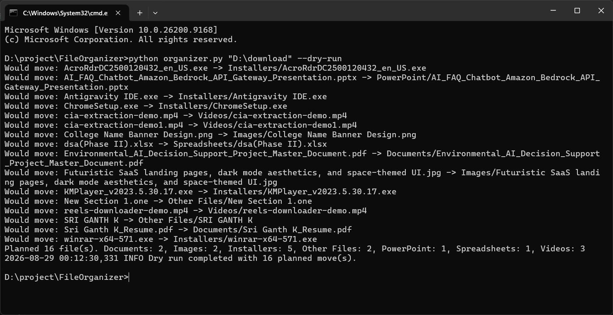
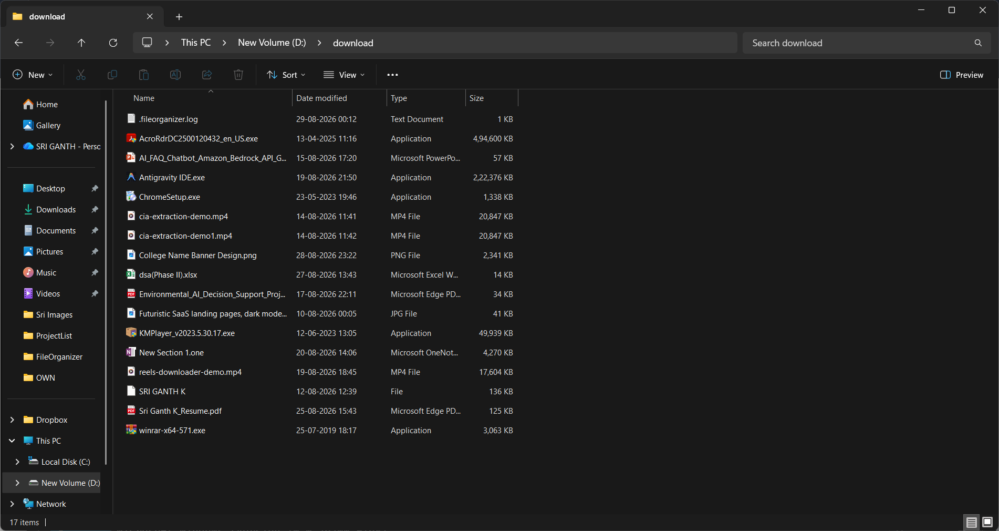
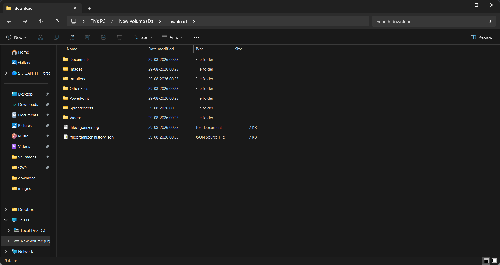
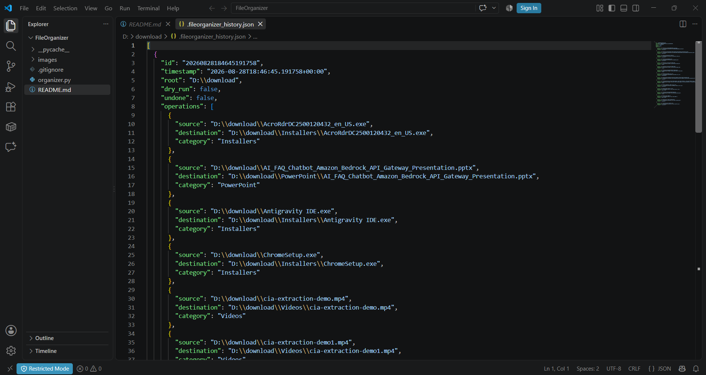

# FileOrganizer

Smart file cleanup for busy folders.

Tired of messy downloads, scattered documents, and folders full of mixed files? FileOrganizer gives you a simple way to clean everything up in one go.

FileOrganizer is a Python utility that sorts files into clear category folders, shows a preview before moving anything, avoids overwriting existing files, and keeps a history so you can undo the last run when needed. It is built to turn folder cleanup into a quick, repeatable habit instead of a manual chore.

## Why This Project Helps

- It saves time when a folder has mixed downloads, documents, media, and code files.
- It makes file cleanup repeatable instead of manual.
- It gives you a safe preview before anything is moved.
- It keeps a history so you can undo the last organizing run.

## How It Works

1. You choose a folder to organize.
2. The script scans the files directly inside that folder.
3. Each file is matched to a category based on its extension.
4. In preview mode, the script shows what would happen without moving anything.
5. In normal mode, the files are moved into category folders and the session is recorded for undo.

## Usage Examples

Preview what would happen:

```powershell
python organizer.py "D:\Downloads" --dry-run
```

### Preview of the organization



Organize files:

```powershell
python organizer.py "D:\Downloads"
```

### Before organizing



### After organized



### Organized history



Undo the most recent organize run for that folder:

```powershell
python organizer.py "D:\Downloads" --undo
```

## Features

- Uses a folder path supplied by the user instead of a hard-coded directory.
- Supports preview mode with `--dry-run`.
- Avoids overwriting files by renaming duplicates safely.
- Organizes common file types into categories like Images, Videos, Audio, Documents, Spreadsheets, PowerPoint, Code, Archives, and Installers.
- Writes a log file for each run.
- Stores organize history so the last run can be undone with `--undo`.
- Skips its own history and log files during organization.
- Keeps the workflow simple with one script and a few flags.

## Output Files

- `.fileorganizer_history.json` stores the undo history.
- `.fileorganizer.log` stores the run log.
- Category folders such as `Images`, `Documents`, and `Code` are created inside the folder you choose.

## Notes

- The tool only processes files directly inside the target folder.
- Files that do not match a known extension are moved into `Other Files`.
- If a file name already exists in a category folder, the new file is renamed safely instead of replacing the old one.
